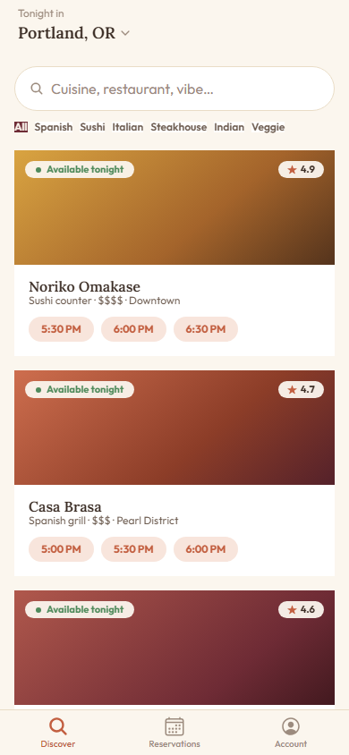
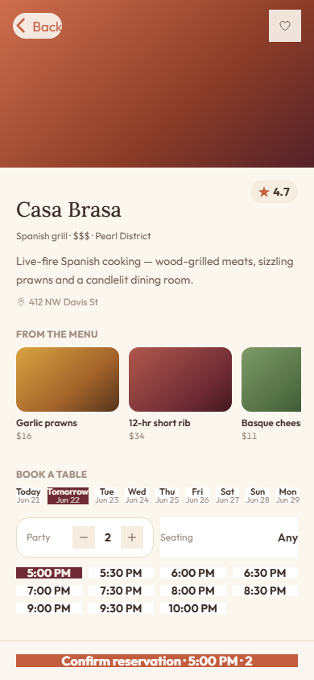
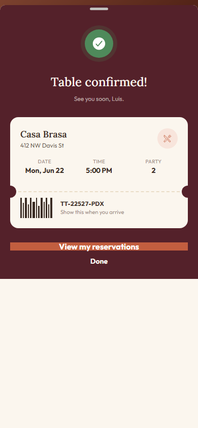
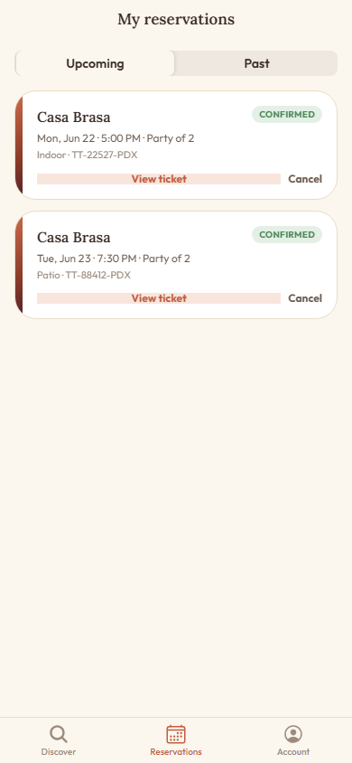
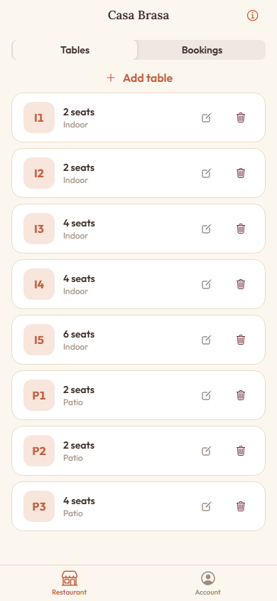
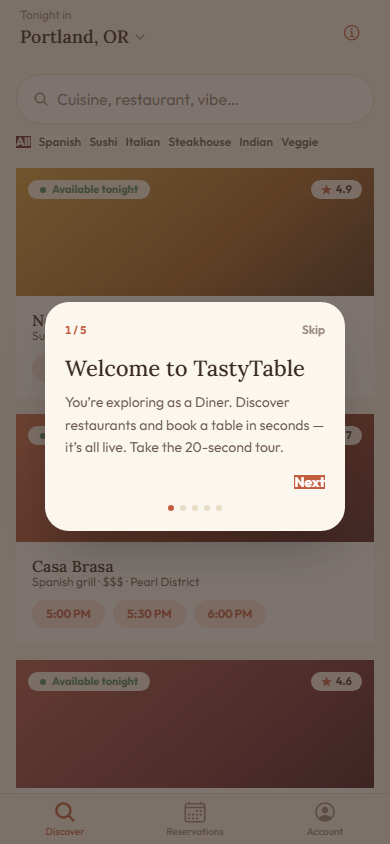

# TastyTable — restaurant discovery & table booking

A mobile-first app to **discover restaurants and book a table in seconds**, with a panel for the restaurant
to manage its floor. **Ionic 8 + Angular 20** (installable **PWA**) on a **NestJS + MongoDB** backend, with a
real **availability engine** (tables, areas and time slots), **JWT auth** with diner/restaurant roles, and a
**role-aware guided demo** layer.

> **Status:** complete and runnable end-to-end locally. Cloud deploy is intentionally deferred (batched with
> the rest of the portfolio).

---

## Highlights

- **Discover & search** — browse by cuisine with search and filters; every card shows tonight's availability.
- **Real availability engine** — slots are derived from each venue's service window, tables and areas, minus
  the day's confirmed bookings; a specific table is held per slot (smallest-fitting table is chosen).
- **Book to a ticket** — pick date / party / area / time, confirm, and get a **ticket** with a code to show on
  arrival. Cancel to free the table.
- **My reservations** — upcoming and past, each viewable as a ticket; cancel with confirmation.
- **Restaurant panel** — owners manage tables (capacity, area) and watch incoming bookings live.
- **Two-tier auth** — JWT access + **rotating refresh tokens** with brute-force lockout; **diner / owner**
  roles gate the API and shape the app.
- **Role-aware guided demo** — a first-run coach-mark tour and a "How to explore" sheet that adapt to your
  role, with a cross-role hint to try the other side.
- **Polish** — warm "appetising" design (Lora + Outfit, terracotta/cream), **EN/ES** i18n, installable PWA,
  and careful loading/empty/error states. Verified at 3 breakpoints.

## Screenshots

| Discover | Restaurant detail + booking | Ticket |
|---|---|---|
|  |  |  |

| My reservations | Owner panel | Guided tour |
|---|---|---|
|  |  |  |

## Stack

| Layer | Tech |
|---|---|
| Frontend | Ionic 8 + Angular 20 (standalone + signals), Tailwind v4, installable PWA |
| Backend | NestJS 11 REST + a table/slot availability engine |
| Database | MongoDB 7 + Mongoose 9 |
| Auth | JWT access + rotating refresh, lockout, diner/owner roles |
| Testing | 21 backend unit tests (Jest) + Playwright E2E (auth, booking, owner, tour) |

## Run it locally

**Prerequisites:** Node 20+, Docker (for MongoDB).

```bash
# 1. MongoDB (port 27018)
docker compose up -d mongo

# 2. Backend — connects + seeds the Portland dining scene on first run
cd backend
npm install
npm run start:dev          # → http://localhost:3013 (/health)

# 3. Frontend (Ionic + Angular)
cd frontend
npm install
npm start                  # → http://localhost:8113
```

Open http://localhost:8113 and sign in with a demo account. Book a table as a diner, then sign in as the
restaurant to see the same booking land in the owner panel.

### Demo accounts

| Role | Email | Password |
|---|---|---|
| Diner | `diner@tastytable.app` | `Taste123!` |
| Restaurant | `owner@casabrasa.app` | `Taste123!` |

## Tests

```bash
# Backend unit tests (Jest)
cd backend && npm test

# Frontend E2E (needs the API on :3013 + MongoDB; starts the web app itself)
cd frontend && npx playwright test
```

## Documentation

- [`docs/PHASES.md`](docs/PHASES.md) — phase-by-phase build log.
- [`TECHNICAL.md`](TECHNICAL.md) — architecture deep-dive (availability engine, data model, auth).

---

Built by **Luis Chiquito Vera** as part of a software-engineering portfolio.
